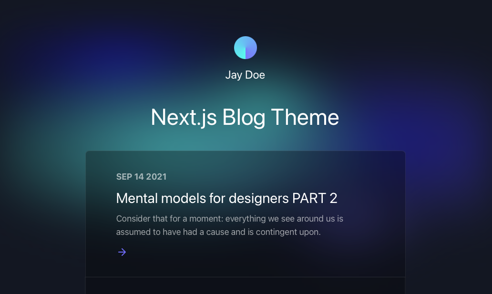

# Next.js Blog Theme Designed by [Bejamas](https://bejamas.io)

[](https://app.netlify.com/start/deploy?repository=https://github.com/netlify-templates/nextjs-blog-theme)

A customizable blog starter using:

- [Next.js](https://github.com/vercel/next.js) v12
- [Tailwind](https://tailwindcss.com/) v3.0
- Built-in [MDX](https://mdxjs.com/) v1 support
- Includes modern design with dark & light themes

<iframe width="560" height="315" src="https://www.youtube.com/embed/U2eTCO_xiHc" title="YouTube video player" frameborder="0" allow="accelerometer; autoplay; clipboard-write; encrypted-media; gyroscope; picture-in-picture" allowfullscreen></iframe>



[Take a gander at the demo.](https://bejamas-nextjs-blog.netlify.app)

### Getting Started

You can get started with this project in two ways: locally or using the [setup wizard](https://nextjs-wizard.netlify.app/).

#### Setting Up Locally

If you're doing it locally, start with clicking the [use this template](https://github.com/netlify-templates/nextjs-blog-theme/generate) button on GitHub. This will create a new repository with this template's files on your GitHub account. Once that is done, clone your new repository and navigate to it in your terminal.

From there, you can install the project's dependencies by running:

```shell
yarn install
```

Finally, you can run your project locally with:

```shell
yarn run dev
```

Open your browser and visit <http://localhost:3000>, your project should be running!

#### Using the Setup Wizard


Through the [setup wizard](https://nextjs-wizard.netlify.app/), you can create your blog in a few clicks and deploy to Netlify.

## Configuring the blog

The config is based on environment variables to make it easy to integrate with any Jamstack platform, like Netlify.

Here are the variables you can edit:
| Variable | Description | Options
| --- | --- | --- |
| `BLOG_NAME` | the name of your blog, displayed below the avatar ||
| `BLOG_TITLE` | the main header (`h1`) on the home page ||
| `BLOG_FOOTER_TEXT`| the text in the footer ||
| `BLOG_THEME` | the theme to pass to Tailwind | default |
| `BLOG_FONT_HEADINGS` | the font-family for all HTML headings, from `h1` to `h6`| sans-serif (default), serif, monospace|
| `BLOG_FONT_PARAGRAPHS` | the font-family for all other HTML elements | sans-serif (default), serif, monospace|

All of the env variables can be configured through the [Wizard](https://nextjs-wizard.netlify.app/) or through setting the project's environment variables. You can do this in your Netlify dashaboard (Site settings/Build & deploy/Environment/Environment variables).

[alt: video walkthrough of editing env vars]

If setting an environment variable isn't your cup of tea, the defaults can be changed in [`utils/global-data.js`](/utils/global-data.js). You can also remove the variables and hard code blog information where these variables are used in the code base.

- `BLOG_THEME, BLOG_FONT_HEADINGS, & BLOG_FONT_PARAGRAPHS` are used in [`tailwind-preset.js`](tailwind-preset.js)
- `BLOG_NAME, BLOG_TITLE, BLOG_FOOTER_TEXT` are used in [`pages/index.js`](pages/index.js) & [`pages/posts/[slug].js`](pages/posts/[slug].js) through the `globalData` object.

## Adding new posts

All posts are stored in `/posts` directory. To make a new post, create a new file with the [`.mdx` extension](https://mdxjs.com/).

Since the posts are written in `MDX` format you can pass props and components. That means you can use [React components](https://reactjs.org/docs/components-and-props.html) inside your posts to make them more interactive. Learn more about how to do so in the [MDX docs on content](https://mdxjs.com/docs/using-mdx/#components).

https://user-images.githubusercontent.com/3611928/152727802-102ec296-41c8-446d-93ed-922d11187073.mp4

[alt: video walkthrough of adding a new blog post]
