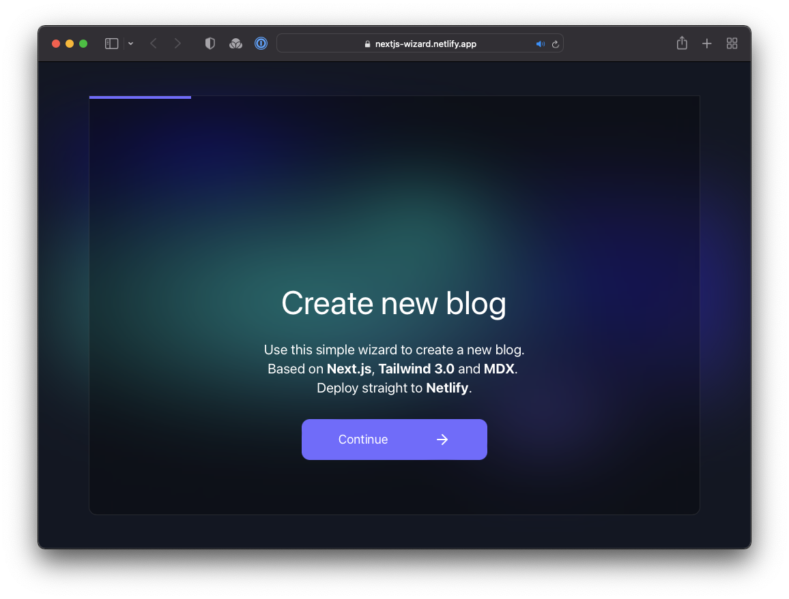

# Next.js Blog Theme Designed by [Bejamas](https://bejamas.io)

[](https://app.netlify.com/start/deploy?repository=https://github.com/netlify-templates/nextjs-blog-theme)

A customizable blog starter using:
- [Next.js](https://github.com/vercel/next.js) v12
- [Tailwind](https://tailwindcss.com/) v3.0
- Built-in [MDX](https://mdxjs.com/) v1 support
- Includes modern design with dark & light themes


[Take a gander at the demo.](https://bejamas-nextjs-blog.netlify.app)

### Getting Started

You can get started with this project in two ways: locally or using the [setup wizard](https://nextjs-wizard.netlify.app/).

#### Setting Up Locally

If you're doing it locally, start with clicking the [use this template](https://github.com/netlify-templates/nextjs-blog-theme/generate) button and clone the repository. Then after navigating in the terminal to the project, you can run these commands:

```shell
yarn install
yarn run dev
```

Your project should then be running on `http://localhost:3000`.

#### Using the Setup Wizard



Through the [setup wizard](https://nextjs-wizard.netlify.app/), you can create your blog in a few clicks and deploy to Netlify.

## Configuring the blog

The config is based on environment variables to make it easy to integrate with any Jamstack platform, like Netlify.

Here are the variables you can edit:

- `BLOG_NAME` - that's the name of your blog and will be displayed below the avatar.
- `BLOG_TITLE` - the main header (`h1`) on the home page, this can be a slogan.
- `BLOG_FOOTER_TEXT` - the text in the footer, usually copyright info.
- `BLOG_THEME`
- `BLOG_FONT_HEADINGS` - the font-family for all HTML headings, from `h1` to `h6`. The value can be one of those:
  - `sans-serif` (selected by default)
  - `serif`
  - `monospace`
- `BLOG_FONT_PARAGRAPHS` - the font-family for all other HTML elements. The value can be one of those:
  - `sans-serif` (selected by default)
  - `serif`
  - `monospace`

All of the env variables can be configured through the [Wizard](https://nextjs-wizard.netlify.app/).

## Adding new posts

All posts are stored in `posts` directory in `.mdx` format. That means you can use React components there to make your posts more interactive.
